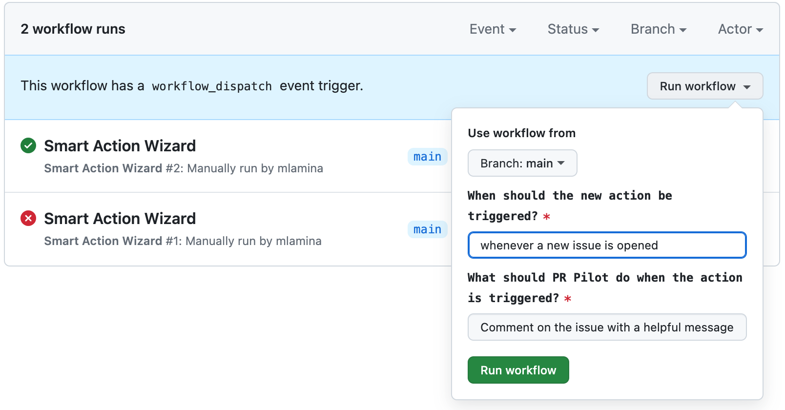

<div align="center">

</div>
<p align="center">
  <a href="https://github.com/apps/pr-pilot-ai/installations/new"><b>Install</b></a> |
  <a href="https://docs.pr-pilot.ai">Documentation</a> | 
  <a href="https://www.pr-pilot.ai/blog">Blog</a> | 
  <a href="https://www.pr-pilot.ai">Website</a>
</p>

# Smart Github Actions

Easy-to-use, AI-powered Github Actions - customized and supercharged using natural language.

## Why do I need this?
Smart Actions can make your daily life on Github easier.
* **It speaks your language** - Instead of writing config files, just use your own words
* **Automate** the tedious and boring work:
  * Checking / formatting / reacting to new issues
  * Making sure new PRs follow your contribution guidelines
  * Maintain a changelog
* **Hand off small development tasks** to an AI agent
  * via comment in issue / PR
  * let the AI agent react to keywords in your commit message


## What is a Smart Action?

A Smart Action is a [GitHub Action](https://docs.github.com/en/actions) enhanced with **AI capabilities**, designed to automate Github projects in powerful new ways. You can use one of our curated, pre-defined actions or build your own.

### Ready-to-use Smart Actions

All the actions defined here are also actively used in this project.

| Action                                                                                                                     | How it helps you                                                                                       |
|----------------------------------------------------------------------------------------------------------------------------|--------------------------------------------------------------------------------------------------------|
| [`format-issue`](https://github.com/PR-Pilot-AI/smart-actions/actions/workflows/issue_formatter.yaml)                      | When a new issue is created, an AI agent formats it, adds labels, checks for spelling errors, and more |
| [`pr-creation-handler`](https://github.com/PR-Pilot-AI/smart-actions/actions/workflows/auto_review_new_pull_requests.yaml) | An AI agent looks at every new PR and runs checks or actions that you define                           |
| [`commit-monitor`](https://github.com/PR-Pilot-AI/smart-actions/actions/workflows/commit_monitor.yaml)                     | Define a keyword / command (e.g. `/task`) and use it in commit messages to delegate follow-up work   |
| [`action-wizard`](https://github.com/PR-Pilot-AI/smart-actions/actions/workflows/generate_new_action.yaml)                 | A manual action that generates new Smart Actions based on a prompt                                     |

## Using Smart Actions in Your Projects

To use a Smart Action in your project, you can reference it in your GitHub workflow files under [`.github/workflows`](https://github.com/PR-Pilot-AI/smart-actions/tree/main/.github/workflows).

Here's a simple example that instructs an AI agent to automatically format and label every new issue in your project:

```yaml
# .github/workflows/issue_formatter.yaml`

name: Ensure new issue is properly formatted and labeled

on:
  issues:
    types: [opened]

jobs:
  format-issue:
    runs-on: ubuntu-latest
    steps:
      - name: Format GitHub Issue
        uses: PR-Pilot-AI/smart-actions/format-issue@v1
        with:

          # API key for PR Pilot must be defined as a secret in the repository
          api-key: ${{ secrets.PR_PILOT_API_KEY }}

          # Number of the issue to be formatted
          issue-number: ${{ github.event.issue.number }}

          # Customize the instructions to your needs
          formatting-instructions: |
            - Ensure the title begins with an appropriate emoji
            - Issue body should be properly Markdown-formatted
            - If the issue has no labels, add some
```

Smart Actions use [PR Pilot](https://github.com/PR-Pilot-AI/pr-pilot) to execute the AI agent on your repository. Follow the **[user guide](https://docs.pr-pilot.ai/user_guide.html)** to get your API key!

## Creating Custom Smart Actions

You can create your own custom actions using the wizard action or manually.

### Using the Action Wizard

The wizard is a special Smart Action that generates new Smart Actions based on your input.



To try it out, just fork the project, put your API Key in the repository secrets ([user guide](https://docs.pr-pilot.ai/user_guide.html)) and run the wizard action.


### Using the Python SDK
For full control and even more customization, you can use the **[PR Pilot Python SDK](https://github.com/PR-Pilot-AI/pr-pilot-python)**.

Every smart action has two components:

* **Action manifest** - A YAML file that describes the action, defines its inputs and what steps to run
* **PR Pilot Instructions** - You instruct the AI agent using the Python SDK

To see how it works, check out how we define our pre-defined actions:

* [Issue Formatter](./format-issue)
* [PR Creation Handler](./pr-creation-handler)
