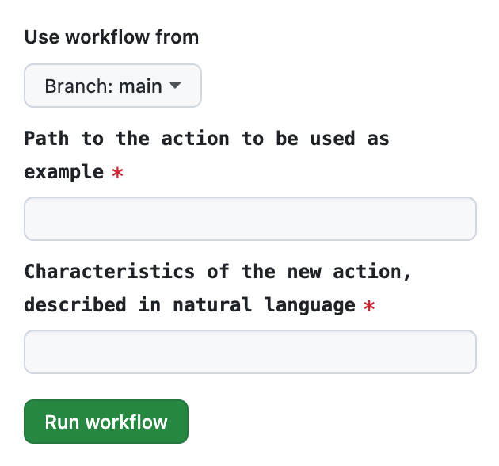

# Replicator Action

The `replicator` action is designed to automate the process of creating new files or code snippets based on existing templates with specified characteristics. This action can significantly streamline your development process by allowing for the quick replication of code or file structures with minimal manual intervention.

## Workflow Ideas

- **Copy Writing Style** Apply the writing style of one document to another document
- **Component Copy Cat** Create a new component / module similar to an existing one
- **Idea Generator** Let AI look at existing codes and generate 1 new Github issue per idea

## Usage

To use the `replicator` action in your project, you'll need to include it in your GitHub workflow files. Specify the template, result path, and characteristics of the result to configure the action for your specific needs.

### Inputs

- `template`: (Required) A description of the code / text / files you want replicated
- `characteristics`: (Required) Characteristics of the result, described in natural language.
- `sdk-version`: (Optional) Specifies the PR Pilot SDK version to use. Default is `1.3.1`.
- `api-key`: (Required) Your API key for PR Pilot.

### Example Workflow

Here is an example that generates a new action based on the code of an existing action.



```yaml
name: Smart Action Copy Cat

on:
  workflow_dispatch:
    inputs:
      action-path:
        description: 'Path to the action to be used as example'
        required: true
      characteristics:
        description: 'Characteristics of the new action, described in natural language'
        required: true

jobs:
  replicate:
    runs-on: ubuntu-latest
    steps:
      - name: Replicate Smart Action
        uses: PR-Pilot-AI/smart-actions/replicator@v1
        with:
          # API key for PR Pilot must be defined as a secret in the repository
          api-key: ${{ secrets.PR_PILOT_API_KEY }}
          # Inputs for the replicator action
          template: |
            ALL files in the directory:
            ${{ inputs.action-path }}
          characteristics: ${{ github.event.inputs.characteristics }}
```
